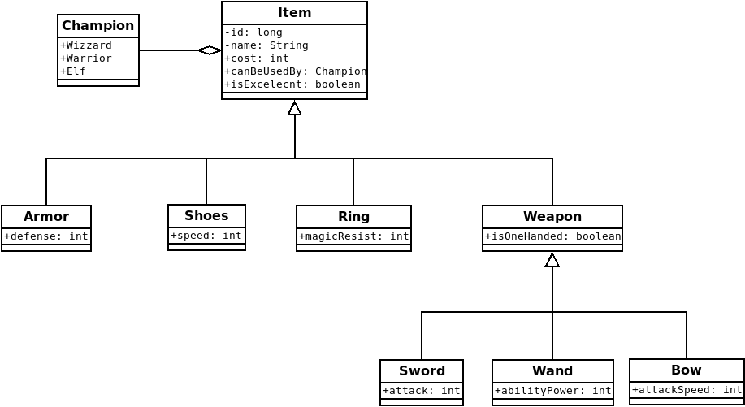
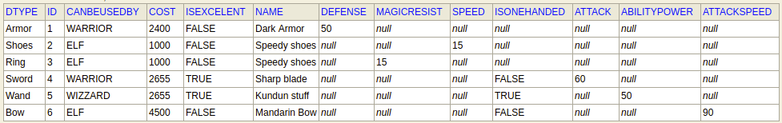
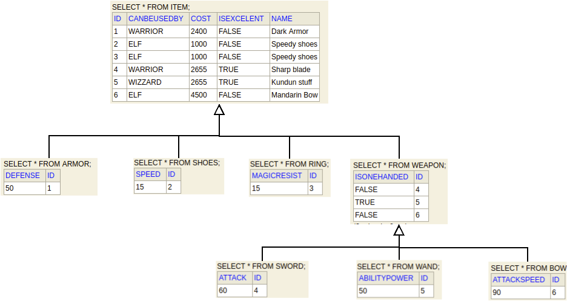
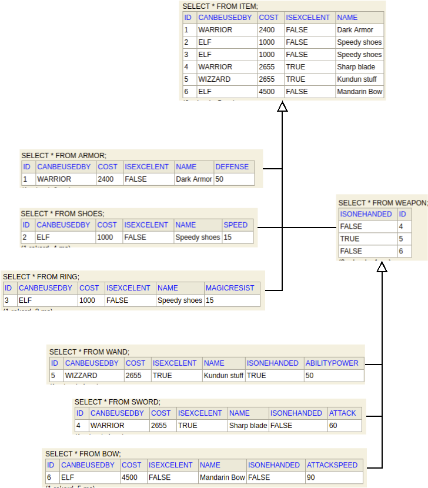

### Info
Relation database __does not__ support inheritance known in java world.
Therefore  **J**ava **P**ersistance **A**PI defines three core strategies 
helping convert class hierarchy into entities:
- Single Table - creates one table for each class hierarchy.
- Joined Table - each class in the hierarchy is mapped to its table.
- Table Per Class - table is defined for each concrete class in the inheritance hierarchy 
to store all the attributes of that class and all of its superclasses.

#### Examples
Lets assume we have hierarchy as shown on the diagram below:

Then single table strategy in data base looks:

Joined table strategy:

Table per class:

Links: 
- [wikibooks](https://en.wikibooks.org/wiki/Java_Persistence/Inheritance)
- [baeldung](https://www.baeldung.com/hibernate-inheritance)

----
### TASK

Check how it works.

Have fun.
