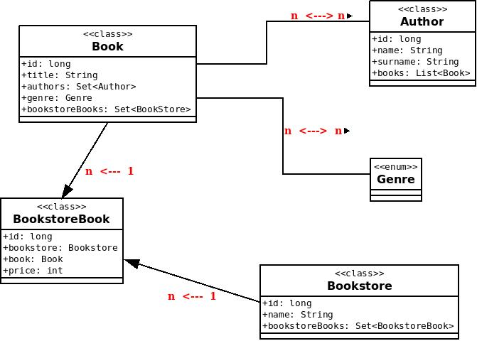

# Model creation

You've got a connection to the database. The next step is to create the needed tables.
In the picture, you can see how it should correspond to each other.
Try to implement these classes with given relations in the package 'model'.

*After implementing classes in model package you can do 'TODO' in Connector class.*